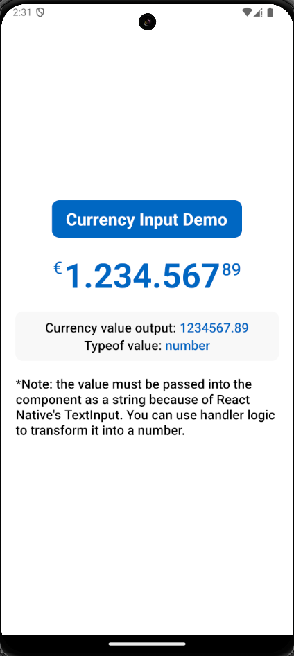

# react-native-money-format-input

A customizable and user-friendly React Native component for real-time currency formatting in input fields. It supports formatting integers and decimals, along with optional currency symbols, and locale-aware number formatting.

---


## Features
- **Real-time currency formatting:** Automatically formats integers and decimals as you type.
- **Locale-aware formatting:** Supports multiple locales for integer formatting (e.g., 1,000 for en-US or 1.000 for de-DE).
- **Customizable styles:** Separate styling options for the currency symbol, integer, and decimal portions.
- **Flexible currency symbol placement:** Allows you to position the currency symbol before or after the number.
- **Input sanitization:** Ensures only valid (string) numeric input is processed. No other characters apart from numbers.

## Installation

Install the library via npm or yarn:

```sh
npm install react-native-money-format-input
# or
yarn add react-native-money-format-input
```

## Usage

Here’s a basic example demonstrating how to use the MoneyInput component:

```js
import React, { useState } from 'react';
import { StyleSheet, View } from 'react-native';
import MoneyInput from 'react-native-money-format-input';

const App = () => {
  const [currencyValue, setCurrencyValue] = useState<number>(0);

  // Handler converts the STRING value (that RN's <TextInput> needs)
  // into a NUMBER and clears it of any extra impurities if any.
  const handleCurrencyValue = (value: string) => {
    const cleanedValue = value.replace(/[^0-9.]/g, '');
    const numericValue = parseFloat(cleanedValue);
    setCurrencyValue(isNaN(numericValue) ? 0 : numericValue);
  };

  return (
    <View style={styles.container}>
      <MoneyInput
        // Only NEEDED prop
        setValue={handleCurrencyValue}
      />
    </View>
  );
};

const styles = StyleSheet.create({
  container: {
    flex: 1,
    justifyContent: 'center',
    alignItems: 'center',
  },
});

export default App;

```

## Props

The `MoneyInput` component accepts the following props:

| Prop Name             | Type                           | Default   | Description                                                                                     |
|-----------------------|--------------------------------|-----------|-------------------------------------------------------------------------------------------------|
| **`setValue`**        | `(finalNumber: string) => void` | **Required** | Callback invoked when the input value changes. The final number is returned as a string. (<TextInput only receives `string` values>)        |
| **`symbol`**          | `string`                      | `"$"`     | The currency symbol to display.                                                                |
| **`symbolAtEnd`**   | `boolean`                     | `false`    | Whether the currency symbol appears before (`false`) or after (`true`) the number.             |
| **`locale`**          | `string`                      | `"en-US"` | Locale string used for formatting the integer portion (e.g., `en-US` for `1,000`).             |
| **`defaultInteger`**  | `string`                      | `""`      | The default integer value (e.g., `"1000"`).                                                    |
| **`defaultFloat`**    | `string`                      | `""`      | The default float value (e.g., `"50"` for `.50`).                                              |
| **`currencySymbolStyle`** | `StyleProp<TextStyle>`    | `null`    | Style applied to the currency symbol.                                                          |
| **`intNumberStyle`**  | `StyleProp<TextStyle>`        | `null`    | Style applied to the integer portion of the number.                                            |
| **`floatNumberStyle`**| `StyleProp<TextStyle>`        | `null`    | Style applied to the decimal portion of the number.                                            |

## Roadmap
### Upcoming Features
- Improved styling: Enhance CSS manipulation for dynamic and responsive styling.
- Enhanced backspace behavior: Add flags to handle specific actions, such as clearing the decimal portion when backspacing an empty integer.
- Digit/character limitations: Allow configuration to limit input size, preventing overflow or excessive digits.


## Contributing

See the [contributing guide](CONTRIBUTING.md) to learn how to contribute to the repository and the development workflow.

## License

MIT

---

Made with [create-react-native-library](https://github.com/callstack/react-native-builder-bob)
